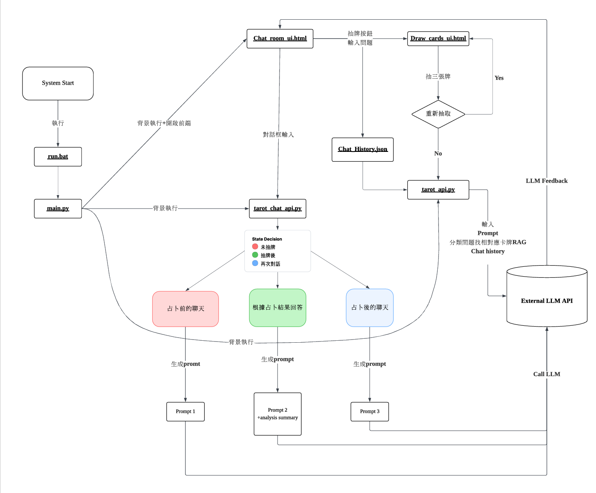
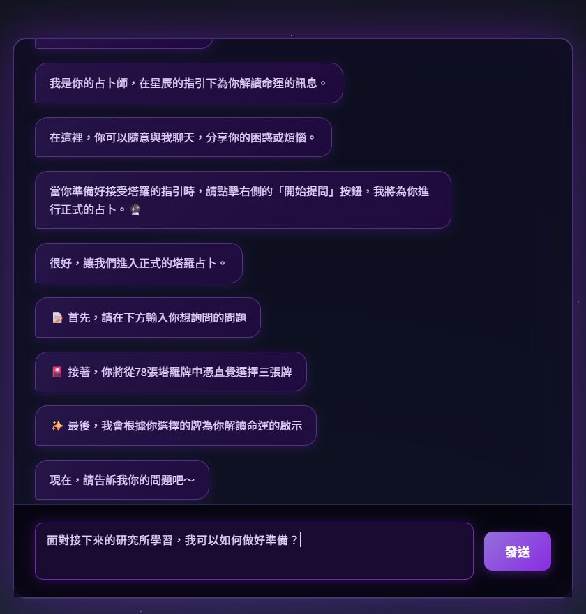
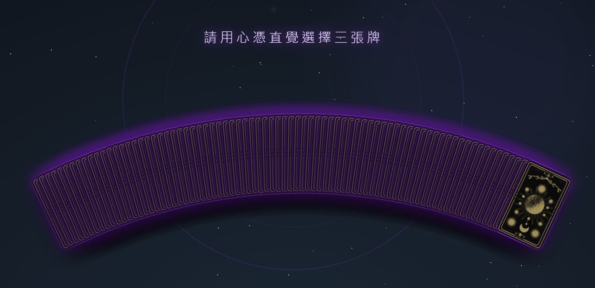
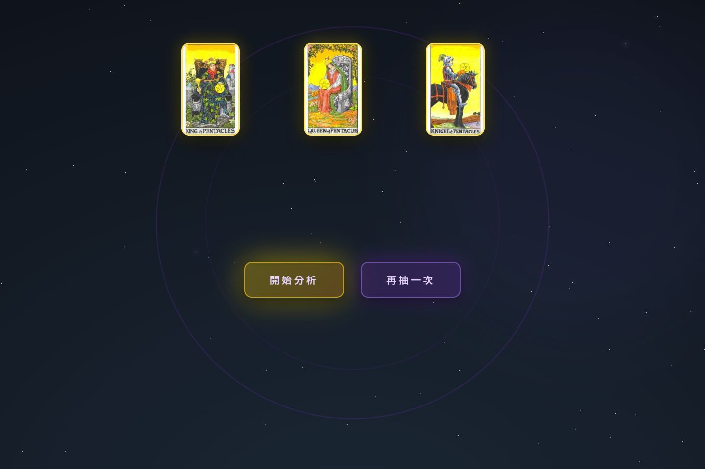
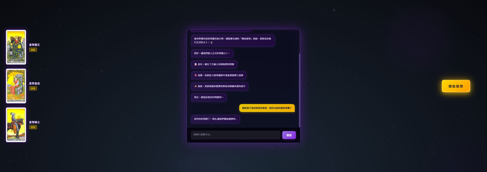

# 計算理論期末專案_🔮 比薩斜塔羅生門

一個結合 **前端互動式塔羅抽牌介面** 與 **後端 AI 敘事引擎** 的塔羅占卜系統。  
使用者可先與占卜師聊天釐清問題，接著抽三張牌，最後由 AI 根據牌面與正逆位生成占卜解讀。

---

## 專案簡介

本專案模擬真實塔羅占卜流程，分為「聊天階段」與「正式占卜階段」：

- 聊天階段：  
  占卜師僅負責傾聽與引導問題，不進行任何抽牌或解牌。
- 占卜階段：  
  使用者提出明確問題後，抽取三張塔羅牌，由 AI 生成對應的敘事式解讀與行動提醒。

整個系統可作為：
- AI 互動式應用展示
- 塔羅占卜 Demo
- 前後端整合與 LLM 應用範例

---

## 系統狀態圖 FSM


---

## 使用技術與工具
### 後端
- Python 3
- Flask
- Flask-CORS
- Threading（同時啟動多個服務）

### 前端
- HTML / CSS / JavaScript
- Fetch API（與後端溝通）
- 前端動畫與互動效果

### AI / LLM
- 模型：gemma3:4b
- API：校內 API Gateway
- 使用 Prompt Engineering 控制占卜語氣與結構

---

## 專案結構說明

```text
.
├── cards_json/               # 78張塔羅牌的牌義解說 JSON
├── cards_pic/                # 78張塔羅牌的圖片檔
├── Chat_History/             # 在一般聊天模式下的聊天紀錄 JSON (占卜模式時會當作input做rag參考)
├── outputs/                  # 占卜結果 JSON 輸出資料夾
├── source_code(without_api)/ # 尚未連接前端的後端source code，可獨立執行並在terminal輸出對話
│   
├── APIKEY.txt                # 金鑰待補；公開版本不含可用金鑰
├── Card_back.png             # 塔羅牌背面圖片
│   
├── Chat_room_ui.html         # 前端：聊天主畫面
├── Draw_cards_ui.html        # 前端：抽牌桌畫面
│
├── tarot_chat_api.py         # 後端：聊天模式 API（Flask，port 8001）
├── tarot_api.py              # 後端：正式占卜 API（Flask，port 5005）
├── main.py                   # 前端伺服器 + 後端整合啟動
├── run.bat                   # 方便啟動系統
│
└── README.md
```
---

## 環境需求

- Python 3.9 以上  
- 作業系統：Windows / macOS / Linux  
- 可使用的 LLM API（本專案預設使用 `gemma3:4b`）

### 必要 Python 套件

```bash
pip install flask flask-cors
```
---

## 啟動方式
1. 到正確的資料夾
```bash
cd C:\Tarot_Final_Project\taro_tarot
```
2. 確保使用環境內有flask相關套件
```bash
pip install flask flask-cors
```
4. 執行run.bat
```bash
./run.bat
```
---

## 使用流程說明
1. 開啟畫面後，可先與占卜師自由聊天
2. 點擊右側「開始提問」
3. 輸入想占卜的問題（一句話即可）
4. 系統進入抽牌畫面
5. 憑直覺選擇三張塔羅牌
6. 點擊「開始分析」
7. 在模型服務與金鑰有效時，回到聊天室顯示占卜解讀與行動提醒

### 操作狀態截圖

以下圖片於 2026-10-04 使用原始介面實際操作擷取，展示前端互動流程。原模型 API 已停止服務，因此本次沒有成功取得 AI 解讀；畫面中的歡迎訊息與提問引導為程式內建文字。

#### 1. 聊天首頁
初始聊天介面，顯示內建歡迎訊息與開始提問按鈕。


#### 2. 提問引導與問題輸入
點擊「開始提問」後，介面顯示引導訊息，使用者輸入想討論的問題。



#### 3. 塔羅選牌
進入抽牌介面，從牌桌中選取三張牌。



#### 4. 三張牌確認
選取後顯示三張牌的翻牌結果，以及重新抽牌、開始分析等操作。



#### 5. 等待分析
按下「開始分析」後的等待畫面。這張截圖僅呈現等待狀態，不代表 AI 解讀已成功生成；本次輸出的 dialogue 與 actions 均為空陣列。



---

## 資料輸出說明
### 聊天紀錄
- 儲存在 Chat_History/{session_id}.json
- 記錄占卜前的聊天內容
### 占卜結果
- 儲存在 outputs/{session_id}.json
- 包含：
  - 抽到的三張牌（含正逆位
  - 抽到的三張牌（含正逆位） 抽到 完整占卜對話
  - 結論建議

---

## 注意事項
- 本系統為三人合作的課程專案；此儲存庫為原專案的 fork，保留原始提交紀錄。
- 原使用的模型 API 已停止服務，原金鑰已撤銷。公開版本的 `APIKEY.txt` 僅保留「待補」占位文字，不是可用金鑰。
- 若要恢復 AI 聊天與解讀，需自行配置有效的模型 API、金鑰與模型名稱；僅填入金鑰不保證原服務可以使用。
- 操作截圖展示可重現的介面狀態，並非目前 AI 解讀功能可用的證明。等待畫面與 HTTP 成功回應也不代表已產生有效解讀，仍應檢查輸出內容。
- 請勿將新金鑰、私人聊天紀錄或含個人資訊的輸出提交至公開儲存庫。
- 本次替換金鑰檔案內容不會移除歷史提交中的舊金鑰；舊金鑰已撤銷，請勿重新使用。
- 若畫面無回應，請確認服務已啟動、Port 8001 / 5005 未被佔用，並檢查 API 連線、授權與後端輸出。
- 塔羅解讀僅供互動展示，不提供醫療、法律、財務建議或結果保證。
